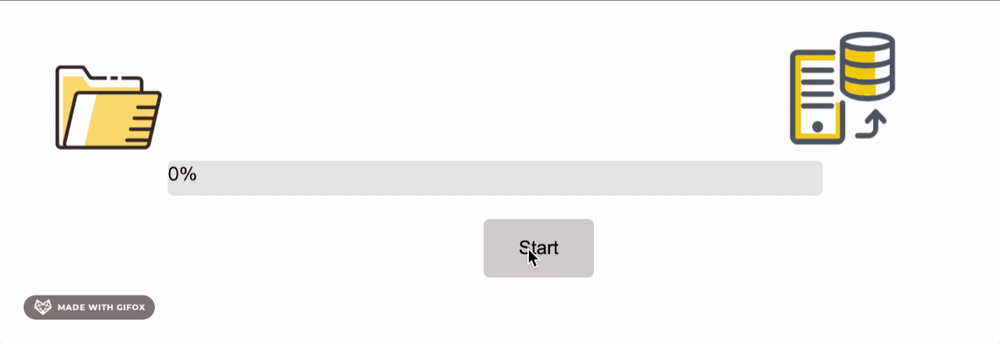

# js-library: ImUpload - image uploader

ImUpload is a pure JavaScript library to provide an image upload widgets, it is a simple frontend library to help you easily build up your own image related website. ImUpload is applied to a variety of image formats, jpg, jpeg, png, gif, that uploaded from user's local computer, it includes two methods to upload image:  selected upload and drag and drop upload, solving the image preview showing problem and contains different processing bar styles.

```
https://github.com/jessica199708/js-Image-Upload-Library
cd js-library-jiajiani
cd pub
cd library
   /ImUpload.js
   /styles.css
   /img
```

## Heroku Link
⇨ Landing page: https://js-library-jiajiani.herokuapp.com/ <br><br>
⇨ Online documentation: https://js-library-jiajiani.herokuapp.com/API.html

## Getting Started
### Folder and File Description
📸 pub: the folder contain the code for the entir library and landing page. <br><br>
📸 pub/library/ImUpload.js: a JavaScript file include all APIs for library, import into your HTML using ```<script src="../library/ImUpload.js" defer=true></script>```.<br><br>
📸 pub/library/styles.css: a CSS style file that contain all styles for library components, import into your HTML using```<link rel="stylesheet" href="../library/styles.css">```.<br><br>
📸 pub/library/img: the folder to store default styled images in the library.<br><br>
📸 pub/library/examples.js: a JavaScript file to show how to use the library in JS file.<br><br>
📸 pub/exampleHTML: HTML page to display the examples for the library and show how to use the library in HTML file.<br><br>


### Example Display and Description
✨ Select image to upload with preview 
  - Try by yourself ⇨ https://js-library-jiajiani.herokuapp.com/exampleHTML/example_select.html
  - Selete image from local computer and the images will display in the preview slide show. The slide show has two side button to switch to left-side or right-side images, the bottom dots are also used for image switchover. A delete button at the right hand side of the slide show frame, clicking it to delete the current display image and a count bar to diaplay how many images upload in total. Mouse hover the current display picture to enlarge it.
  - It supports multi-time upload
  - After successfully upload, an alert will come out to show how many images have been uploaded during this uploading time.
  - HTML you need:
  ```
    <div class="upload-area">
        <button id="btn">Upload Images</button>
        <input id="fileupload" onchange="imUpload.selectWithPreview()" accept="image/*" type="file"
            multiple="multiple" />
    </div>
    <div id="slideshow-container">
        <!-- Slider default Preview page -->
        <div class="mySlides fade" style="display:block"></div>
        <!-- Side buttons: switch to previous or next image locate at the left and right side of silder-->
        <a id="prev">&#10094;</a>
        <a id="next">&#10095;</a>
        <a id="countBar"></a>
    </div>
    <div class="dotBar">
        <span class="dot"></span>
        <span class="dot"></span>
        <span class="dot"></span>
        <span class="dot"></span>
        <span class="dot"></span>
        <span class="dot"></span>
    </div>
  ```


✨ Drag and drop image to upload with preview 
  - Try by yourself ⇨ https://js-library-jiajiani.herokuapp.com/exampleHTML/example_drag.html
  - Drag and drop the images to specified drop area from local computer and the images will display in the preview slide show. The slide show has two side button to switch to left-side or right-side images, the bottom dots are also used for image switchover. A delete button at the right hand side of the slide show frame, clicking it to delete the current display image and a count bar to diaplay how many images upload in total. Mouse hover the current display picture to enlarge it.
  - It supports multi-time upload
  - After successfully upload, an alert will come out to show how many images have been uploaded during this uploading time.
  - HTML you need:
  ```
    <div id="drop-region">
        <div class="drop-message">
            Drag & Drop images here to upload
        </div>
        <div id="image-preview"></div>
    </div>
    <div id="slideshow-container">
        <div class="mySlides fade" style="display:block"></div>
        <span id="countBar"></span>
        <a id="prev">&#10094;</a>
        <a id="next">&#10095;</a>
    </div>
    <div class="dotBar">
        <span class="dot"></span>
        <span class="dot"></span>
        <span class="dot"></span>
        <span class="dot"></span>
        <span class="dot"></span>
        <span class="dot"></span>
    </div>
  ```


✨ Select image to upload with automatic slide preview
  - Try it by yourself ⇨ https://js-library-jiajiani.herokuapp.com/exampleHTML/example_autoSelect.html
  - Selete image from local computer and the images will display in the preview automatic switch slide show. The default speed of image switch is 3sec/pic, you are be able to change speed in the input box in unit sec/pic. Also, a delete button can delete the current display image. Mouse hover the current display picture to enlarge it.
  - It supports multi-time upload
  - HTML you need:
  ```
    <div class="autoupload-area">
        <button id="autobtn">Upload Images</button>
        <input id="autofileupload" onchange="imUpload.autoSelectUpload()" accept="image/*" type="file"
            multiple="multiple" />
    </div>
    <button id="autodeleteBtn" onclick="imUpload.deleteAuto()">Delete</button><br>
    <div id='speedDiv'>
        <label id="speedLabel">Switch speed</label>
        <input placeholder="3s" id="speedInput">
        <button type="submit" value="Submit" id='speedBtn' onclick=imUpload.changeSpeed()>Change</button>
    </div>
    <div id="autoslideshow-container">
        <div class="automySlides fade"></div>
        <div class="numberDisplay"></div>
    </div>
  ```


✨ Progress bar 
  - Try it by yourself ⇨ https://js-library-jiajiani.herokuapp.com/exampleHTML/example_fileProgress.html
  - It is a styled progress bar that can increment from 0% to 100% by pressing Start button, the default styles are ```img/image_file.png``` and ```img/image_server.png```
  - HTML you need:
  ```
   <form>
        
        <div id="myProgress">
            <div id="myBar"></div>
        </div>
        

        <div class="container">
            <input id="fileBtn" type="button" value="Start" onclick="imUpload.fileProgress();" />
        </div>
    </form>
  ```



